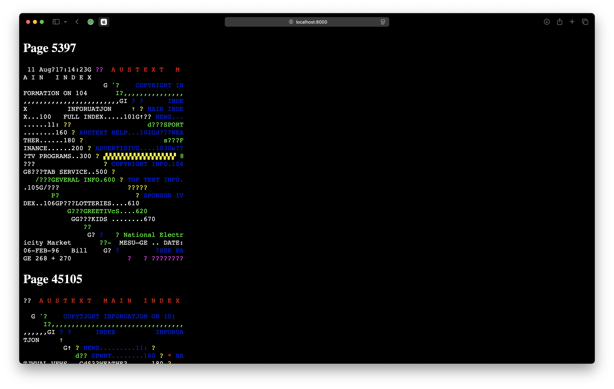

# Teletext to JSON

Convert a teletext `.t42` file to `JSON` for visualisation.

## Setup

* Install Python on your system

## Convert

* Save your `.t42` file as `input.t42`
* Convert the the file to JSON: `python3 t42_to_json.py`
* Your JSON file will appear as `output.json`
* Start the web server: `python3 -m http.server`
* Visit an `html` preview at: http://localhost:8000



### JSON output

```json
{
  "pages": [
    {
      "magazine": 2,
      "page": 5397,
      "subpage": 533,
      "rows": [
        [
          {
            "char": " ",
            "fg": "white",
            "bg": "black",
            "is_graphics": false,
            "concealed": false
          },
          {
            "char": "1",
            "fg": "white",
            "bg": "black",
            "is_graphics": false,
            "concealed": false
          },
        ]
      ]
    }
  ]
}
```

## Tools

Built with Grok 3.

## References

* [vhs-teletext](https://github.com/ali1234/vhs-teletext)
* [.t42 packet stream](https://teletext.wiki.zxnet.co.uk/wiki/T42_packet_stream)
